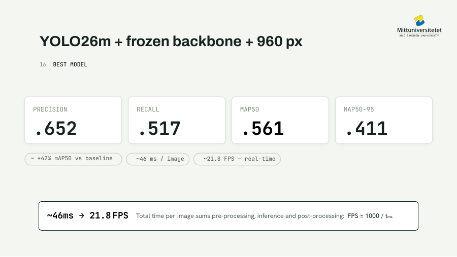
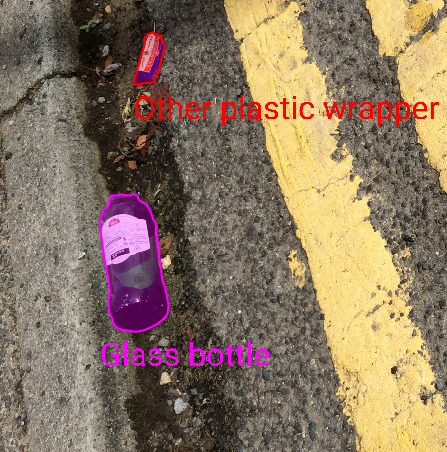
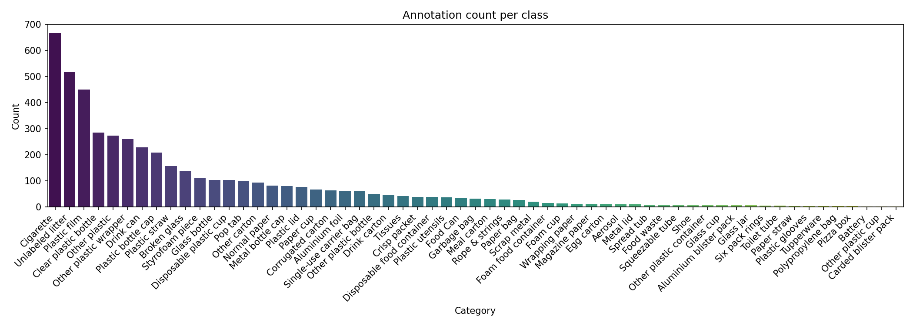
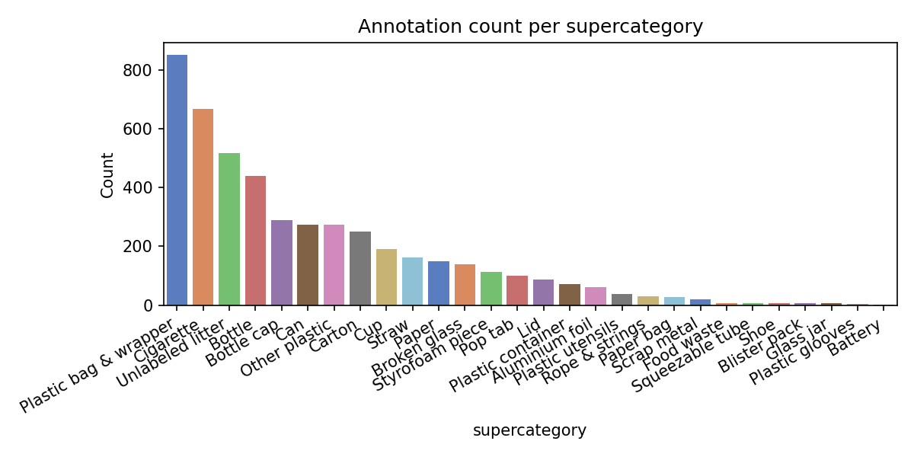
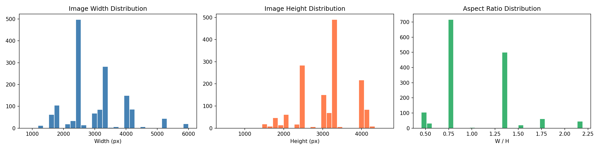
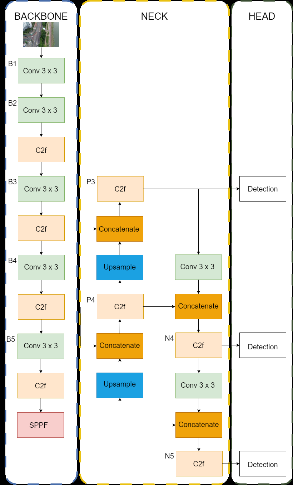
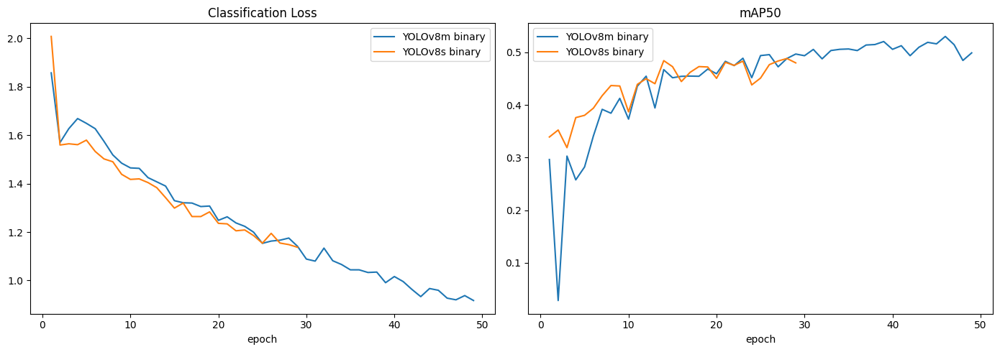
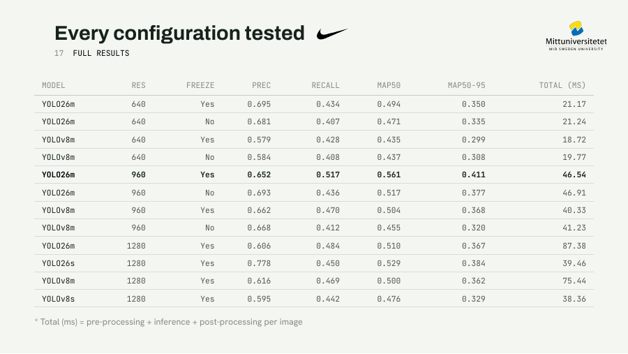

# Real-Time Waste Detection with YOLO

<p align="center">

  <strong>Transfer learning, dataset remapping, controlled model comparison and speed-accuracy analysis on the TACO litter dataset</strong>

</p>


<p align="center">
  
</p>

## Overview

This project investigates real-time waste detection in unconstrained outdoor scenes using YOLO-based object detectors and the [TACO (Trash Annotations in Context)](http://tacodataset.org/) dataset.

The work goes beyond training a single pretrained detector. It studies how performance changes when varying:

- **The label representation**: 60 original categories, 28 supercategories or one binary `trash` class

- **The model family and capacity**: YOLOv8s, YOLOv8m, YOLO26s and YOLO26m

- **The input resolution**: 640, 960 and 1280 pixels

- **The transfer-learning strategy**: full fine-tuning vs selective layer freezing

- The balance between **detection accuracy and end-to-end latency**

The main result is that the data representation had a larger effect than the initial architecture change. Collapsing the severely imbalanced multiclass task into binary waste detection substantially improved localization performance. The strongest recorded configuration was YOLO26m at 960 px with frozen early layers, reaching 0.561 mAP50, 0.411 mAP50-95 and approximately 21.5 FPS from combined preprocessing, inference and postprocessing time.

### Qualitative inference demo

The following handheld street-footage demo shows the trained detector applied outside the curated validation set. It provides a qualitative test under uncontrolled camera motion, illumination, object scale, background clutter and partial occlusion.

**Watch** [the street-inference demo](assets/demo/street_detection.mp4).

> The visible playback delay should not be interpreted as isolated model
> inference latency. The recording also includes video decoding, preprocessing,
> annotation rendering, postprocessing and video encoding overhead.


## Task formulation

This is an object-detection problem, not image classification. A classifier predicts what appears in an image. A detector must predict both:

- **what** each object is
- **where** it is, using a bounding box

A predicted box is evaluated against its ground-truth box using **Intersection over Union (IoU)**. For small objects, even a modest coordinate error can produce a large reduction in IoU. This explains why the prevalence of tiny litter instances is especially important in this project.


## Project difficulties

TACO contains approximately 1,500 images, 4,784 annotated objects and 60 fine-grained waste categories. The images were captured in natural environments rather than controlled studio conditions.

<p align="center">
  
</p>

The dataset presents several difficulties that directly affect detector training:

1. **Severe class imbalance:** A small number of categories account for a large proportion of annotations, while many classes have very few examples

2. **Small objects:** Waste often occupies only a small fraction of the image, making feature extraction and bounding-box localization difficult

3. **Visual variability:** Illumination, background clutter, occlusion, scale, viewpoint, image resolution and aspect ratio vary considerably

4. **Limited data volume:** The dataset is too small to train a modern detector reliably from random initialization, which motivates transfer learning

### Dataset analysis

The exploratory analysis confirmed two central characteristics of the dataset: a strongly imbalanced label distribution and substantial variation in image dimensions. These properties motivated the comparison between fine-grained, supercategory and binary label representations.

<p align="center">
  
</p>

<p align="center">
  
</p>

<p align="center">
  
</p>


## Dataset pipeline

The original TACO annotations use COCO-style JSON. The project converts them into the directory and label format expected by Ultralytics YOLO.

1. Original TACO repository
	
2. COCO-style annotations.json + downloaded images
	
3. Class remapping
	1. 60 original categories
	2. 28 supercategories
	3. 1 binary class: trash
	
4. Deterministic image split
	1. 75% training
	2. 15% validation
	3. 10% test
	
5. COCO \[x, y, width, height\] boxes
	1. converted to normalized YOLO
	2. \[class, x_center, y_center, width, height\]
	
6. YOLO images/labels directory + dataset.yaml


The split is generated at the image level, so all annotations belonging to one image remain in the same partition. With 1,500 source images, this corresponds to approximately:

| Split      | Fraction | Images |
| ---------- | -------: | -----: |
| Train      |      75% |  1,125 |
| Validation |      15% |    225 |
| Test       |      10% |    150 |

### Label configurations

| Configuration       | Classes | Purpose                                                                             |
| ------------------- | ------: | ----------------------------------------------------------------------------------- |
| Original categories |      60 | Preserve the full fine-grained TACO classification                                  |
| Supercategories     |      28 | Reduce label fragmentation by grouping related materials or object types            |
| Binary              |       1 | Detect whether an annotated waste object is present, without predicting its subtype |

The same image split and box geometry are reused across these three representations. Only the class mapping changes, making the initial dataset comparison meaningful.


## Model architecture and transfer learning

<p align="center">
  
</p>

A modern YOLO detector can be understood through three functional components:

- **Backbone:** extracts hierarchical visual features. Early layers tend to capture generic structures such as edges and textures, while deeper layers encode more task-specific patterns.

- **Neck:** combines features from multiple spatial scales, which is particularly important for detecting objects of very different sizes.

- **Detection head:** predicts bounding-box coordinates, object confidence and class information.

### Transfer learning

All models were initialized from pretrained weights rather than trained from scratch. This is appropriate because TACO is small relative to the capacity of modern detection networks. Transfer learning reuses visual representations learned from a much larger source dataset and adapts them to the waste domain.

### What freezing means here

The project compares full fine-tuning with selective freezing through the Ultralytics `freeze` parameter:  

- YOLOv8 experiments use `freeze=10`

- YOLO26 experiments use `freeze=11`

Freezing prevents the selected early modules from updating during backpropagation while later modules remain trainable. The intended trade-off is:

- preserve reusable low-level features

- reduce the number of trainable parameters

- regularize adaptation on a small dataset

- potentially limit domain adaptation if too much of the network is frozen

Freezing affects training behavior, not the mathematical cost of the final forward pass. The results therefore do not imply that frozen models are intrinsically faster at inference.

  

## Training pipeline

The pipeline was implemented with **Ultralytics YOLO on PyTorch**. Ultralytics handled dataset loading, batching, resizing, normalization, augmentation, mixed-precision execution where supported, validation, checkpointing and metric logging.

The project initially used Google Colab. Because reading the dataset directly from Google Drive introduced an input bottleneck, the data was copied to local runtime storage before training. Later medium-model and high-resolution experiments were run in Kaggle GPU environments to support longer uninterrupted jobs.

### Documented extended experiment sweep

The report and presentation document the following shared settings for the later binary experiments:

| Parameter               | Value                                            |
| ----------------------- | ------------------------------------------------ |
| Dataset                 | Binary TACO configuration                        |
| Epoch budget            | 100                                              |
| Input resolution        | 640, 960, or 1280                                |
| Batch size              | 32 at 640/960; 16 in the documented 1280 px runs |
| Optimizer               | AdamW                                            |
| Initial learning rate   | 0.001                                            |
| Weight decay            | 0.0005                                           |
| Early-stopping patience | 15                                               |
| Transfer learning       | Pretrained weights                               |
| Freeze setting          | None, `10` for YOLOv8, or `11` for YOLO26        |

The archived repository does not contain the complete `runs/` directories or final model weights for this sweep. Consequently, the final table below is supported by the project report and presentation, while the 25-epoch dataset experiment is additionally supported by executable notebook code and captured Ultralytics output.
  


## Evaluation metrics

The project reports four standard detection metrics and a latency measurement.

### Precision

```text

Precision = TP / (TP + FP)

```

Precision measures how many predicted detections were correct. A high value means the detector produces relatively few false positives.

### Recall

```text

Recall = TP / (TP + FN)

```

Recall measures how many annotated objects were found. In environmental monitoring or robotic collection, missed litter appears as a false negative, so recall is operationally important.

### AP and mAP

**Average Precision (AP)** summarizes the precision-recall curve for one class. **Mean Average Precision (mAP)** averages AP across classes and, depending on the metric, across IoU thresholds.

- **mAP50:** AP evaluated at IoU = 0.50. It is relatively tolerant of localization error.

- **mAP50-95:** AP averaged from IoU 0.50 to 0.95 in steps of 0.05. It rewards more precise localization and is therefore stricter.

For the binary dataset, class averaging is trivial because there is only one class, but averaging across IoU thresholds remains essential for mAP50-95.


<p align="center"> 
	
</p>

The curves show that both binary models progressively reduced their classification loss while validation mAP50 generally improved throughout training. YOLOv8m continued improving for longer and ultimately achieved the stronger result, although the validation metric exhibits the expected epoch-to-epoch variability of a small dataset.

### End-to-end timing

The final comparison reports:

```text

Total time = preprocessing + inference + postprocessing

FPS = 1000 / total_time_ms

```


This is more informative than reporting neural-network inference alone because it better approximates the complete per-image pipeline. It is still a benchmark from a particular software and hardware environment, not a universal deployment guarantee.
  


## Results

### 1. Dataset representation

The first controlled experiment used YOLOv8s at 640 px for approximately 25 epochs.

| Dataset representation | Precision |    Recall |     mAP50 |  mAP50-95 |
| ---------------------- | --------: | --------: | --------: | --------: |
| 60 original categories |     0.407 |     0.185 |     0.181 |     0.110 |
| 28 supercategories     |     0.465 |     0.176 |     0.178 |     0.107 |
| Binary `trash`         | **0.492** | **0.412** | **0.394** | **0.218** |
  
The binary representation produced the largest improvement in the project. Fine-grained classification was limited by sparse minority classes, whereas the binary task allowed the network to concentrate on objectness and localization using all waste annotations as examples of the same class.

This does not mean binary detection is universally superior. It solves a less detailed task. The result demonstrates that the available data supported reliable waste localization better than reliable fine-grained waste recognition.

### 2. Initial architecture scaling

After selecting the binary dataset, the initial 100-epoch comparison produced:

| Model   | Precision |    Recall |     mAP50 |  mAP50-95 |
| ------- | --------: | --------: | --------: | --------: |
| YOLOv8s |     0.518 |     0.288 |     0.326 |     0.184 |
| YOLOv8m | **0.564** | **0.352** | **0.379** | **0.211** |

The medium model improved all four metrics, but the gain was modest relative to the improvement obtained by changing the dataset representation.

### 3. Model, resolution, and freezing sweep

| Model   | Resolution | Frozen layers | Precision |    Recall |     mAP50 |  mAP50-95 | Total time (ms) |
| ------- | ---------: | :-----------: | --------: | --------: | --------: | --------: | --------------: |
| YOLO26m |        640 |      Yes      | **0.695** | **0.434** | **0.494** | **0.350** |           21.17 |
| YOLO26m |        640 |      No       |     0.681 |     0.407 |     0.471 |     0.335 |           21.24 |
| YOLOv8m |        640 |      Yes      |     0.579 | **0.428** |     0.435 |     0.299 |       **18.72** |
| YOLOv8m |        640 |      No       | **0.584** |     0.408 | **0.437** | **0.308** |           19.77 |
| YOLO26m |        960 |      Yes      |     0.652 | **0.517** | **0.561** | **0.411** |           46.54 |
| YOLO26m |        960 |      No       | **0.693** |     0.436 |     0.517 |     0.377 |           46.91 |
| YOLOv8m |        960 |      Yes      |     0.662 | **0.470** | **0.504** | **0.368** |       **40.33** |
| YOLOv8m |        960 |      No       | **0.668** |     0.412 |     0.455 |     0.320 |           41.23 |
| YOLO26m |       1280 |      Yes      |     0.606 | **0.484** |     0.510 |     0.367 |           87.38 |
| YOLO26s |       1280 |      Yes      | **0.778** |     0.450 | **0.529** | **0.384** |           39.46 |
| YOLOv8m |       1280 |      Yes      | **0.616** | **0.469** | **0.500** | **0.362** |           75.44 |
| YOLOv8s |       1280 |      Yes      |     0.595 |     0.442 |     0.476 |     0.329 |       **38.36** |

<p align="center">
  
</p>

### Main observations

#### Resolution helps until its computational and optimization costs dominate

For frozen YOLO26m, increasing the input from 640 to 960px improved mAP50 from **0.494 to 0.561** and mAP50-95 from **0.350 to 0.411**. The higher spatial sampling helps preserve information about small objects.

At 1280px, mAP50 fell to **0.510** while total time increased to **87.38 ms**. This run also used a smaller batch size, so the 960-to-1280 comparison is not perfectly isolated. The correct interpretation is that 960px was the best tested operating point, not that resolution above 960 is intrinsically harmful.

#### Freezing usually improved recall and localization quality

In the matched 640 and 960px YOLO26m comparisons, freezing improved recall, mAP50 and mAP50-95. For YOLOv8m, the effect depended on resolution: the unfrozen 640px model had marginally higher mAP values, while freezing clearly improved recall and mAP at 960px.

#### YOLO26m provided the strongest accuracy results

Under the matched binary, 640px setup, frozen YOLO26m achieved 0.494 mAP50 compared with 0.435 for frozen YOLOv8m. At 960px, it reached the highest mAP50 and mAP50-95 in the recorded sweep.

#### The fastest model is not the most accurate model

The 960px YOLO26m configuration is the best accuracy-oriented model, while lower-resolution and smaller models provide lower latency. This is the central deployment trade-off: small-object accuracy benefits from resolution and capacity, but both increase computational cost.


## Selected model

### Best accuracy and best balanced research result

**YOLO26m, 960 px, frozen early layers**

| Metric             |         Result |
| ------------------ | -------------: |
| Precision          |          0.652 |
| Recall             |          0.517 |
| mAP50              |          0.561 |
| mAP50-95           |          0.411 |
| End-to-end time    | 46.54 ms/image |
| Derived throughput |      21.49 FPS |

Weights: [`assets/weights/yolo26m_960_frozen_best.pt`](yolo26m_960_frozen_best.pt)

### Fastest recorded medium-model configuration

**YOLOv8m, 640 px, frozen early layers**

- 18.72 ms/image

- approximately 53.4 FPS from the recorded total time

- 0.435 mAP50

- 0.299 mAP50-95

This is a stronger candidate when throughput matters more than maximum detection accuracy.


## What the experiments demonstrate

### Data design can matter more than architecture scaling

The largest improvement came from changing the target representation, not simply increasing model size. This is a practical example of the principle that model performance is bounded by annotation density, label quality and class balance.

### Transfer learning is essential for limited datasets

The project reuses pretrained visual features and adapts them to litter detection. Selective freezing often improved generalization by constraining how much the network could change on a small dataset.

### Input resolution is a task-dependent hyperparameter

Higher resolution preserves more evidence for tiny objects but increases GPU memory use and latency. The best resolution is therefore an empirical speed-accuracy compromise rather than a universally maximal value.

### Precision and recall describe different failure modes

A detector with high precision may still miss many objects, while a detector with high recall may create more false alarms. Waste monitoring, robotic picking and sorting systems may assign different costs to those errors, so a single metric should not be used in isolation.
  


## Limitations

- **Small and imbalanced dataset:** rare categories cannot be learned robustly from the available number of examples.

- **Binary simplification:** the best-performing setup detects waste but does not identify material or object subtype.

- **Small-object sensitivity:** tiny annotations remain difficult even at higher resolution.

- **1280px confounder:** those runs used a different batch size, so resolution is not the only changed training parameter.

- **No systematic hyperparameter search:** optimizer, learning rate, augmentation, freezing depth, and batch size were not explored through a controlled search procedure.


## Notebook roles

-  [`notebooks/data_analysis.ipynb`](notebooks/data_analysis.ipynb): exploratory analysis of image metadata, annotations, class distributions, missing values and dataset characteristics.

- [`notebooks/train.ipynb`](notebooks/train.ipynb): deterministic split generation, COCO-to-YOLO conversion, three class-remapping strategies, and the verified 25-epoch YOLOv8s comparison.

- [`notebooks/legacy/waste_disposal.ipynb`](notebooks/legacy/waste_disposal.ipynb): an earlier experimental notebook retained as project history.


## Reproducing the verified dataset experiment

The dataset preparation and 25-epoch comparison are available in [`notebooks/train.ipynb`](notebooks/train.ipynb).

A clean execution requires:

1. downloading TACO images and `annotations.json` from the official dataset source

2. updating the notebook paths or replacing the Google Drive paths with local project-relative paths

3. running the preprocessing cells to create all three YOLO datasets

4. installing the dependencies

5. running the training and test-evaluation cells

Indicative dependencies used by the notebooks include:

```bash

pip install ultralytics pycocotools pandas numpy matplotlib pillow scikit-learn tqdm

```

### Reproducing the full final sweep

The complete 100-epoch sweep cannot currently be reproduced from the public snapshot alone because the final run configurations, result CSV files and weights are not all present. The report and presentation preserve the experiment matrix and outputs, but exact reproducibility requires restoring or regenerating those artifacts.

All 17 runs (configs, metrics and result CSVs) are published on Kaggle: [TACO results dataset](https://www.kaggle.com/datasets/marcozenna/taco-results). This is the raw output behind the tables above, useful for digging into a specific configuration or re-plotting the sweep.


## Project documentation

- [Final project report](docs/report.pdf)
- [Final presentation](docs/presentation.pdf)

## Authors

- **Javier Jerez Reinoso**
- **Marco Zennaro**  

Developed for **DT068A Image Analysis** course at Mid Sweden University.


> This was a collaborative academic project by **Javier Jerez Reinoso** and **Marco Zennaro** for the DT068A Image Analysis course at Mid Sweden University. Ultralytics supplied the detection framework and pretrained model implementations; the project work focused on TACO analysis, annotation conversion, experimental design, training, evaluation, and interpretation.


## References and attribution

- P. F. Proença and P. Simões, *TACO: Trash Annotations in Context for Litter Detection*, 2020.

- [TACO dataset and source repository](https://github.com/pedropro/TACO)

- [Ultralytics YOLO documentation](https://docs.ultralytics.com/)

- [PyTorch](https://pytorch.org/)

The TACO dataset, Ultralytics software, pretrained weights and other third-party components remain subject to their respective licenses. A repository-wide license should only be selected after confirming compatibility with the exact Ultralytics version and any redistributed model weights.
